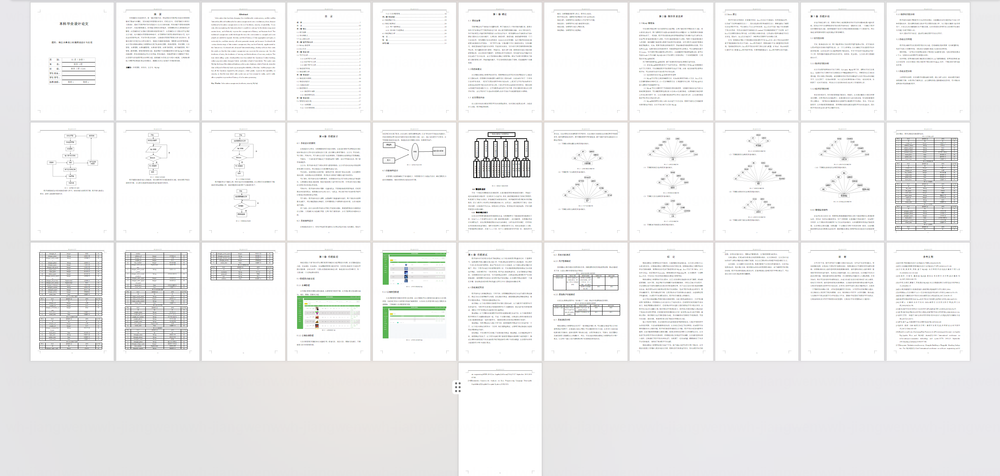

<h1 align="center">基于SpringBoot+Vue的精品水果线上销售系统【带论文】</h1>

- <b>完整代码获取地址：从戎源码网 ([https://armycodes.com/](https://armycodes.com/))</b>
- <b>技术探讨、资料分享，请加QQ群：692619798</b>
- <b>作者微信：19941326836  QQ：952045282</b>
- <b>承接计算机毕业设计、Java毕业设计、Python毕业设计、深度学习、机器学习</b>
- <b>选题+开题报告+任务书+程序定制+安装调试+论文+答辩ppt 一条龙服务</b>
- <b>所有选题地址 ([https://github.com/Descartes007/allProject](https://github.com/Descartes007/allProject)) </b>

## 一、项目介绍

基于SpringBoot+Vue的精品水果线上销售系统，系统主要角色为管理员（后台）、商家与用户（前端），核心功能如下：
### 管理员（后台）
- 基本操作：登录、修改密码、获取/修改个人信息、登出
- 用户管理：查询/新增/查看/修改/删除用户、重置密码、获取 session 用户
- 商品管理（水果）：分页列表、查看详情、新增/修改/删除、上下架、推荐/特价标记、库存管理、批量导入（xls）
- 订单管理：订单分页/详情/修改/删除、导入、后台订单统计与管理
- 商家管理：商家信息的增删改查与审核范围控制
- 评论/收藏管理：查看与管理商品评价、用户收藏记录
- 公告/文件管理：公告发布、文件上传与静态资源支持
### 商家
- 商品维护：仅操作自身商品的新增/修改/删除/上架下架、查看商品统计（点击量等）
- 订单查看：查看与处理与自己商品相关的订单
- 资料管理：商家信息维护
### 用户（前端）
- 账号相关：注册、登录、登出、查看/修改个人信息
- 商品浏览：商品列表、筛选、排序、详情查看（点击量统计）
- 购物车：加入购物车、购物车列表、修改/删除条目
- 下单与支付：创建订单、余额支付（下单时校验库存与用户余额）、订单详情、订单列表
- 收藏与评价：收藏商品、对已购商品发表评论
- 地址管理：新增/修改/删除/设为默认收货地址

## 二、项目技术

- 编程语言：Java（后端）
- 架构：B/S 架构
- 后端技术：Spring Boot 2.x，MyBatis / MyBatis-Plus，MySQL，Fastjson、Hutool、
- 前端技术：Vue 2.x、Vue Router，Element UI，axios，vue-quill-editor（富文本）

## 三、运行环境

- JDK版本：1.8及以上都可以
- 操作系统：Windows7/10、MacOS
- 开发工具：IDEA、Ecplise、MyEclipse都可以

## 四、数据库配置文件

- npm版本：6.14.13及以上都可以
- Redis版本：3.2.100及以上都可以
- 文件名：application.yml
- 编码类型：utf8

## 论文截图

## 系统截图

